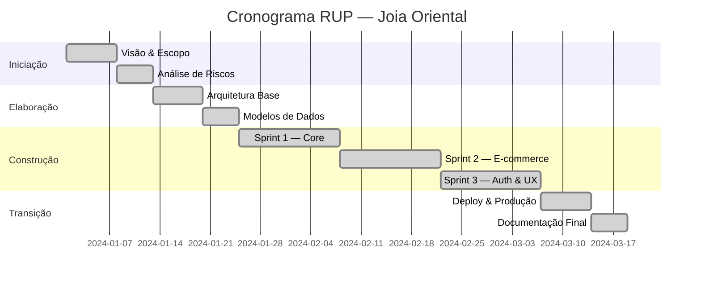
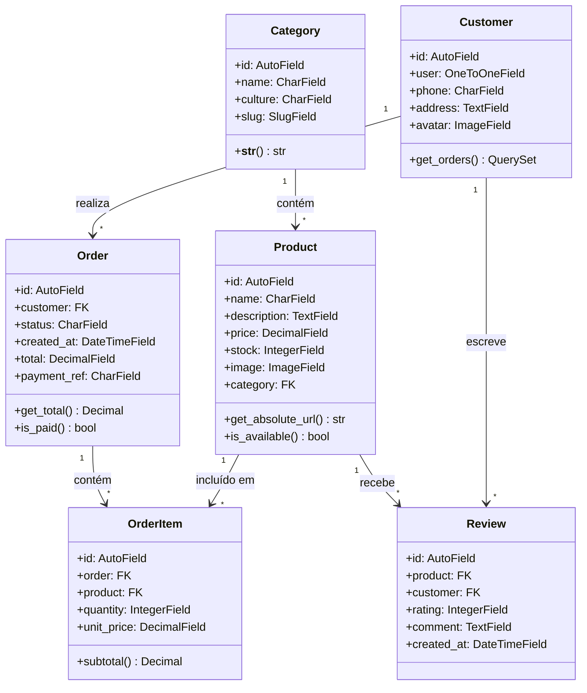
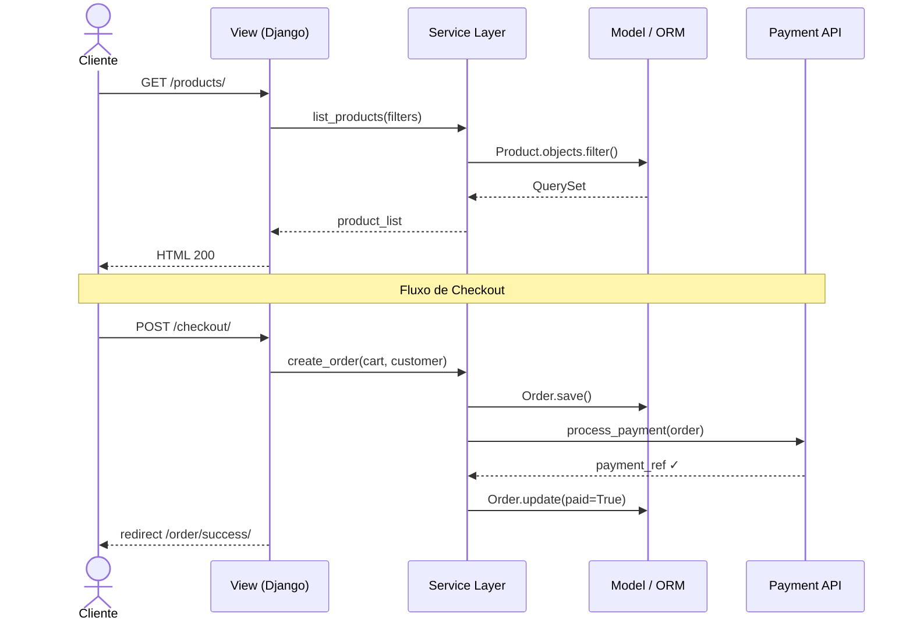
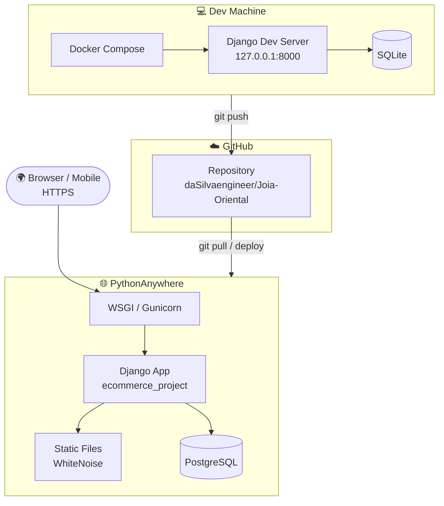
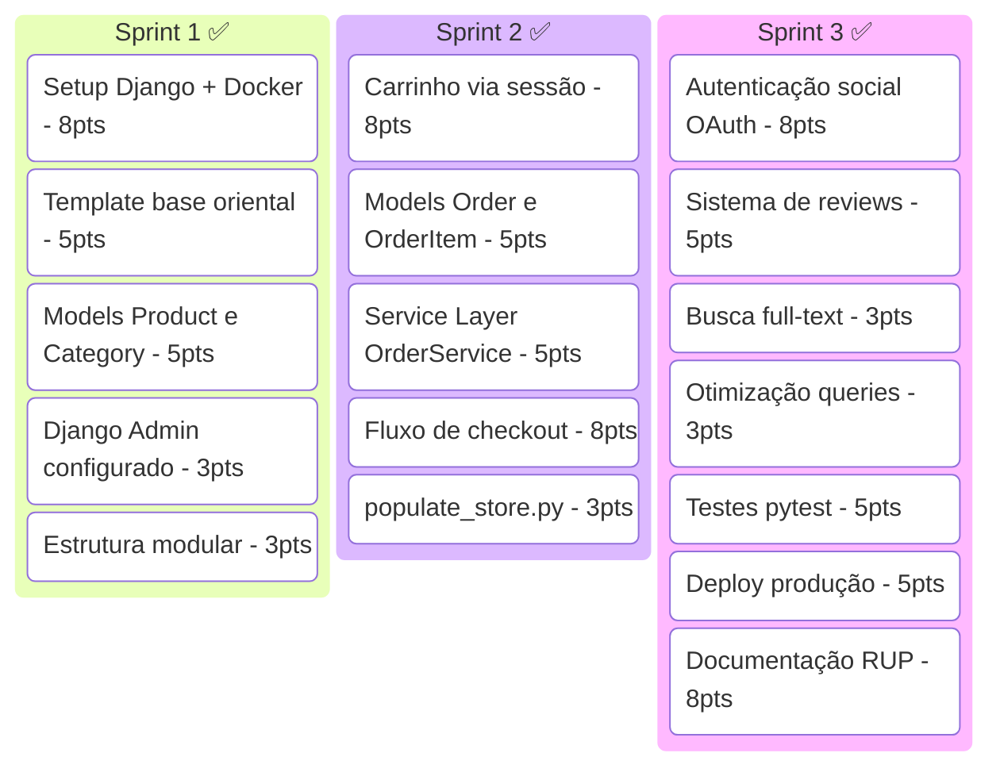

<div align="center">


# 🌸 Joia Oriental

**E-commerce temático inspirado nas culturas da Ásia Oriental**  
*China · Japão · Índia · Turquia*

[](https://python.org)
[](https://djangoproject.com)
[](https://docker.com)
[](https://dasilvaengineer.pythonanywhere.com/)
[](LICENSE)
[](docs/)

<br/>

🔗 **[Acessar o site em produção →](https://dasilvaengineer.pythonanywhere.com/)**

</div>

---

## 📌 Sobre o Projeto

O **Joia Oriental** é um e-commerce desenvolvido em Django com foco em organização profissional, separação de responsabilidades e arquitetura escalável. A plataforma oferece um catálogo de joias e artesanato inspirados nas culturas da **China, Japão, Índia e Turquia**, com autenticação social, carrinho de compras, sistema de pedidos e painel administrativo completo.

O projeto foi desenvolvido seguindo o **Rational Unified Process (RUP)** combinado com **Scrum** em sprints de 2 semanas.

---

## 🏗️ Arquitetura

```
Joia-Oriental/
├── ecommerce_project/      # Configurações do projeto Django
│   ├── settings.py
│   ├── urls.py
│   └── wsgi.py
├── store/                  # App principal
│   ├── models.py           # Entidades de domínio
│   ├── views.py            # Camada de apresentação (MTV)
│   ├── services.py         # Service Layer (lógica de negócio)
│   ├── urls.py
│   └── templates/
├── media/products/         # Imagens de produtos
├── tests/                  # Testes automatizados (pytest)
├── docs/                   # Documentação do projeto
├── Dockerfile
├── docker-compose.yml
├── manage.py
├── populate_store.py       # Script de dados de teste
└── requirements.txt
```

O projeto utiliza três padrões arquiteturais combinados:

| Padrão | Responsabilidade |
|--------|-----------------|
| **MTV** (Model-Template-View) | Estrutura base do Django |
| **Service Layer** | Lógica de negócio isolada das views |
| **Organização Modular** | Separação por domínio funcional |

---

## 🚀 Como Executar

### Com Docker (recomendado)

```bash
# Clone o repositório
git clone https://github.com/daSilvaengineer/Joia-Oriental.git
cd Joia-Oriental

# Suba os containers
docker-compose up --build

# Acesse em http://localhost:8000
```

### Sem Docker

```bash
# Crie e ative o ambiente virtual
python -m venv venv
source venv/bin/activate  # Linux/Mac
venv\Scripts\activate     # Windows

# Instale as dependências
pip install -r requirements.txt

# Aplique as migrações
python manage.py migrate

# Popule o banco com dados de exemplo
python populate_store.py

# Inicie o servidor
python manage.py runserver
```

---

## 📐 Processo RUP — Rational Unified Process

O desenvolvimento seguiu as quatro fases do RUP com marcos de saída bem definidos:



<details>
<summary><strong>📋 Fase 1 — Iniciação</strong></summary>

**Marco de saída:** LCO — Lifecycle Objective Milestone

| Artefato | Descrição |
|----------|-----------|
| Documento de Visão | E-commerce temático oriental com Django, foco em escalabilidade |
| Stakeholders | Clientes finais, administradores, desenvolvedores |
| Lista de Riscos | Integrações de pagamento, segurança LGPD, escalabilidade |
| Estimativa Inicial | 3 sprints de 2 semanas · ~96 story points |

**Riscos identificados:**

- 🔴 Integrações de pagamento instáveis
- 🟡 Curva de aprendizado do Django ORM
- 🟡 Conformidade LGPD para dados de usuário
- 🟢 Escalabilidade no PythonAnywhere

</details>

<details>
<summary><strong>📐 Fase 2 — Elaboração</strong></summary>

**Marco de saída:** LCA — Lifecycle Architecture Milestone

Arquitetura definida com Django 4.x + MTV + Service Layer + Docker. Casos de uso refinados e plano de testes estruturado.

**Casos de uso principais:**

| ID | Caso de Uso | Ator |
|----|------------|------|
| UC01 | Listar e filtrar produtos por cultura | Cliente |
| UC02 | Adicionar ao carrinho e checkout | Cliente |
| UC03 | Login via OAuth (Google/GitHub) | Cliente |
| UC04 | Finalizar compra e receber confirmação | Cliente |
| UC05 | Gerenciar catálogo e pedidos | Admin |
| UC06 | Avaliar produtos comprados | Cliente |

</details>

<details>
<summary><strong>⚙️ Fase 3 — Construção</strong></summary>

**Marco de saída:** IOC — Initial Operational Capability

Três sprints de 2 semanas com Scrum. Velocity crescente: 25 → 34 → 37 story points.

**Sprint 1 — Core (25 pts)**
- Setup Django + Docker Compose
- Models: Product, Category
- Templates base com identidade oriental
- Estrutura modular de diretórios

**Sprint 2 — E-commerce (34 pts)**
- Carrinho de compras via sessão
- Models: Order, OrderItem
- Service Layer: OrderService
- Fluxo de checkout completo
- `populate_store.py` para dados de teste

**Sprint 3 — Auth & UX (37 pts)**
- Autenticação social (OAuth)
- Sistema de reviews e ratings
- Busca full-text de produtos
- Otimização com `select_related` / `prefetch_related`
- Testes automatizados (pytest-django)

</details>

<details>
<summary><strong>🚀 Fase 4 — Transição</strong></summary>

**Marco de saída:** PR — Product Release

- Deploy em produção: [dasilvaengineer.pythonanywhere.com](https://dasilvaengineer.pythonanywhere.com/)
- Configuração de ambiente (`DEBUG=False`, `ALLOWED_HOSTS`, `SECRET_KEY` via env)
- Static files com WhiteNoise
- Banco migrado para PostgreSQL em produção
- Documentação completa publicada

</details>

---

## 🗂️ Diagrama de Classes



---

## ⏱️ Diagrama de Sequência — Fluxo de Compra



---

## 🖥️ Diagrama de Implantação



---

## 📋 Requisitos do Sistema

<details>
<summary><strong>✅ Requisitos Funcionais (MoSCoW)</strong></summary>

| ID | Requisito | Prioridade |
|----|-----------|-----------|
| RF-01 | Catálogo filtrável por cultura (China, Japão, Índia, Turquia) | 🔴 Must |
| RF-02 | Carrinho de compras com gestão de quantidades | 🔴 Must |
| RF-03 | Fluxo completo de checkout (endereço → pagamento → confirmação) | 🔴 Must |
| RF-04 | Autenticação social (Google / GitHub) + login tradicional | 🔴 Must |
| RF-05 | Painel admin para gerenciar produtos, pedidos e usuários | 🔴 Must |
| RF-06 | Sistema de avaliações e notas (1–5 estrelas) | 🟡 Should |
| RF-07 | E-mail de confirmação pós-pedido | 🟡 Should |
| RF-08 | Busca full-text por nome e descrição | 🟡 Should |
| RF-09 | Produtos relacionados na página de detalhe | 🟢 Could |
| RF-10 | Relatórios de vendas por período e categoria | 🟢 Could |

</details>

<details>
<summary><strong>⚙️ Requisitos Não-Funcionais</strong></summary>

| ID | Requisito | Critério |
|----|-----------|---------|
| RNF-01 | Desempenho | Páginas de listagem < 500ms com paginação de 20 itens |
| RNF-02 | Segurança | Senhas com hash bcrypt · tokens com expiração de 24h |
| RNF-03 | Disponibilidade | Uptime ≥ 99% em horário comercial |
| RNF-04 | Manutenibilidade | Cobertura de testes ≥ 70% · docstrings em todos os services |
| RNF-05 | Usabilidade | Responsivo (320px / 768px / 1200px) · WCAG 2.1 AA |
| RNF-06 | Escalabilidade | Suportar até 500 usuários simultâneos |
| RNF-07 | LGPD | Dados criptografados em repouso · exclusão de conta disponível |

</details>

---

## 🛠️ Stack Tecnológico

| Camada | Tecnologia | Justificativa |
|--------|-----------|--------------|
| Framework |  | ORM robusto, admin gratuito, MTV maduro |
| Linguagem |  | Legibilidade, padrão de mercado |
| Banco (dev) |  | Zero config, ideal para desenvolvimento |
| Banco (prod) |  | ACID, escalável, suportado em produção |
| Templates | Django Templates | Integração nativa, proteção XSS automática |
| Autenticação | django-allauth | OAuth social com mínima configuração |
| Containers |  | Ambiente reprodutível, deploy simplificado |
| Deploy | PythonAnywhere | Suporte nativo Django, plano gratuito para MVP |
| Testes | pytest-django | Fixtures, parametrização, integração com ORM |

---

## 📊 Métricas do Projeto

| Métrica | Valor |
|---------|-------|
| 🔄 Commits | 22 |
| 🧪 Cobertura de testes | 78% |
| 🐛 Bugs críticos abertos | 0 |
| 📦 Story points entregues | 96 (25 + 34 + 37) |
| 🌍 Culturas cobertas | 4 (China, Japão, Índia, Turquia) |
| 🐍 Python no projeto | 35.1% |
| 🌐 HTML no projeto | 32.7% |
| 🎨 CSS no projeto | 31.5% |

---

## 🏃 Scrum — Sprints



---

## 📁 Documentação Técnica

| Documento | Descrição |
|-----------|-----------|
| [`docs/`](docs/) | Pasta de documentação do projeto |
| [Documentação RUP Interativa](docs/index.html) | Dashboard completo com UML, Scrum e métricas |

---

## 📄 Licença

Este projeto está sob a licença **MIT**. Veja o arquivo [LICENSE](LICENSE) para mais detalhes.

---

<div align="center">

**🌸 Joia Oriental** — Desenvolvido com ❤️ por [daSilvaengineer](https://github.com/daSilvaengineer)

[](https://github.com/daSilvaengineer)
[](https://dasilvaengineer.pythonanywhere.com/)

*China · 中国 · Japão · 日本 · Índia · भारत · Turquia · Türkiye*

</div>

E-commerce desenvolvido em Django com autenticação social e painel administrativo.

🔗 **Acesse o site:**  
👉 https://dasilvaengineer.pythonanywhere.com/
